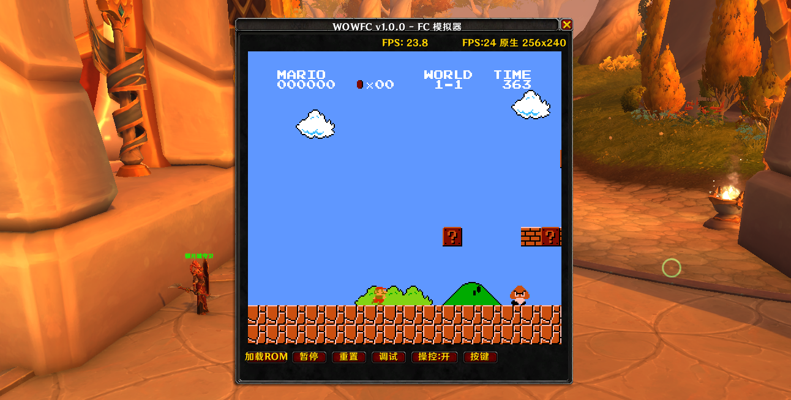

# WOWFC - World of Warcraft FC/NES Emulator

A World of Warcraft addon that runs FC/NES games inside the game.

[English](README.md) | [简体中文](README.zh-CN.md)




## Features

- Run FC/NES games inside World of Warcraft
- Support for multiple mappers (Mapper0, Mapper1, Mapper4)
- Customizable key bindings
- Frame skip optimization for different performance environments
- Turbo (rapid fire) support
- Debug mode

## Installation

### Method 1: Direct Download

1. Download the ZIP file from this repository
2. Extract and copy the `WowFC` folder to your WoW addon directory:
   - Retail: `World of Warcraft\_retail_\Interface\AddOns\`
   - Classic: `World of Warcraft\_classic_\Interface\AddOns\`
3. Restart the game or click "AddOns" button at character selection screen

### Method 2: Git Clone

```bash
cd "World of Warcraft\_retail_\Interface\AddOns"
git clone https://github.com/yourusername/WOWFC.git WowFC
```

## Usage

### Basic Controls

- Type `/fc` or `/wowfc` to open/close the emulator window
- Press `ESC` to exit control mode
- Window is draggable to adjust position

### Loading Games

1. Place your `.nes` format ROM files in the `WowFC/ROMs/` directory
2. Run the conversion tool `tools/convert_roms.py` to convert ROMs to Lua data format
3. Run `/reload` in-game to load the new ROMs
4. Click the "Load ROM" button in the addon interface to select and load a game

> **Note**: ROM files may have copyright issues. Please do not commit ROM files to the repository.
>
> **ROM Download**: You can download NES ROM files from [ROMSFUN](https://romsfun.com/roms/nes/)

### Key Binding

Click the "Key Binding" button in the interface to customize keyboard mappings for FC controller buttons.

### Commands

| Command | Description |
|---------|-------------|
| `/fc` | Open/close emulator window |
| `/fc skip <1-10\|auto>` | Set frame skip (for performance tuning) |
| `/fc prof` | Show performance profile data |
| `/fc profreset` | Reset performance profile data |
| `/fc debug` | Show debug information |
| `/fc boost` | Toggle performance boost mode |

## Project Structure

```
WowFC/
├── Core/           # Emulator core
│   ├── CPU.lua     # 6502 CPU emulation
│   ├── PPU.lua     # Picture Processing Unit
│   ├── ROM.lua     # ROM loader
│   ├── FC.lua      # Main emulator logic
│   └── Mappers/    # Various mapper implementations
├── Utils/          # Utility modules
├── UltraRenderer.lua  # Renderer
├── Keybinding.lua  # Key binding
└── WOWFC.lua       # Addon main entry
```

## Technical Notes

This project is based on:

- World of Warcraft Lua API for UI rendering
- Pure Lua implementation of 6502 CPU and PPU emulation

## Important Notes

1. **ROM Copyright**: This project does not include any game ROMs. Users must prepare their own legal ROM files.
2. **Performance Requirements**: The emulator requires computational resources. Recommended for use on better-configured computers.
3. **Compatibility**: Currently supports World of Warcraft 12.0+.

## Known Limitations

- **No Audio**: APU (Audio Processing Unit) is not emulated, so there is no sound output
- **Limited Mapper Support**: Currently only supports Mapper 0, 1, and 4. Limited ROM compatibility
- **Performance Issues**: Performance issues exist. Frame skip may be required on lower-end systems to maintain playable speed

## Project Status

⚠️ **Current version is for testing only**. There are many limitations and issues. Pull Requests are welcome to help improve the project!

## License

This project is open-sourced under the [MIT License](LICENSE).


## Authors

[黑科研]胡涂 / [黑科研]童

---

**Disclaimer**: This addon is for educational and communication purposes only. It is not affiliated with Blizzard Entertainment.
