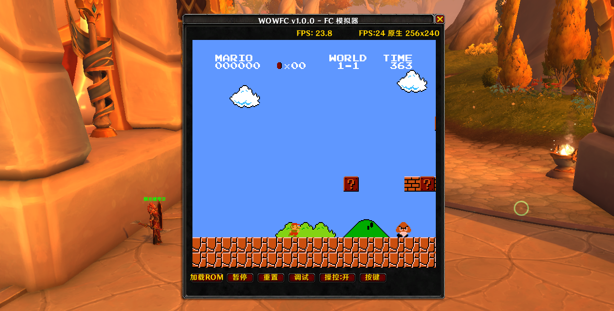

# WowFC - 魔兽世界 FC 模拟器

在魔兽世界游戏中运行 FC/NES 游戏的插件。

[English](README.md) | [简体中文](README.zh-CN.md)




## 功能特性

- 在魔兽世界中运行 FC/NES 游戏
- 支持多种 Mapper（Mapper 0、1、2、3、4）
- 可自定义按键映射
- 帧跳过优化，适配不同性能环境
- 支持连发（Turbo）功能
- 调试模式支持
- 可选逐扫描线精确渲染
- 声音开关
- 性能增强模式（运行时解除 WoW 帧率上限）

## 安装方法

### 方法一：GitHub Release（推荐）

1. 前往 [Releases](https://github.com/huchang47/WowFC/releases) 页面
2. 下载最新的 `WowFC-vX.X.X.zip`
3. 解压后将 `WowFC` 文件夹复制到魔兽世界的插件目录：
   - 正式服：`World of Warcraft\_retail_\Interface\AddOns\`
   - 怀旧服：`World of Warcraft\_classic_\Interface\AddOns\`
4. 重启游戏或在角色选择界面点击"插件"按钮加载

### 方法二：CurseForge

通过 [CurseForge](https://www.curseforge.com/wow/addons/wowfc) 安装，客户端会自动管理更新。

### 方法三：Git 克隆

```bash
cd "World of Warcraft\_retail_\Interface\AddOns"
git clone https://github.com/huchang47/WowFC.git WowFC
```

## 使用方法

### 基本操作

- 输入 `/fc` 或 `/wowfc` 打开/关闭模拟器窗口
- 按 `ESC` 键退出操控模式
- 窗口可拖动调整位置

### 加载游戏

1. 将你的 `.nes` 格式 ROM 文件放入 `WowFC/ROMs/` 目录
2. 运行转换工具 `tools/convert_roms.py` 将 ROM 转换为 Lua 数据格式
3. 在游戏内输入 `/reload` 重新加载插件
4. 点击插件界面上的"加载 ROM"按钮选择并加载游戏

> **注意**：ROM 文件可能有版权问题，请勿在仓库中提交 ROM 文件。

### 按键设置

点击界面上的"改键"按钮，可以自定义 FC 手柄按键对应的键盘按键。

### 命令列表

| 命令 | 说明 |
|------|------|
| `/fc` | 打开/关闭模拟器窗口 |
| `/fc skip <1-10\|auto>` | 设置帧跳过（用于性能调节） |
| `/fc scanline <on\|off>` | 切换逐扫描线精确渲染 |
| `/fc sound <on\|off>` | 切换声音输出 |
| `/fc boost` | 切换性能增强模式 |
| `/fc prof` | 显示性能分析数据 |
| `/fc profreset` | 重置性能分析数据 |
| `/fc debug` | 显示调试信息 |
| `/fc bench [帧数] [轮数]` | 运行渲染器基准测试（默认 60 帧 × 3 轮） |
| `/fc help` | 显示帮助信息 |

## 项目结构

```
WowFC/
├── Core/           # 模拟器核心
│   ├── CPU.lua     # 6502 CPU 模拟
│   ├── PPU.lua     # 图像处理单元
│   ├── ROM.lua     # ROM 加载器
│   ├── FC.lua      # 主模拟器逻辑
│   └── Mappers/    # 各种 Mapper 实现
├── Utils/          # 工具模块
├── Sound/          # 声音采样资源
├── ROMs/           # ROM 目录（仓库中仅 README）
├── UltraRenderer.lua  # 渲染器
├── Keybinding.lua  # 按键映射
├── WOWFC.lua       # 插件主入口
└── WOWFC.toc       # 插件清单
```

## 技术说明

本项目基于以下技术：

- 使用魔兽世界 Lua API 进行 UI 渲染
- 纯 Lua 实现的 6502 CPU 和 PPU 模拟

## 注意事项

1. **ROM 版权**：本项目不包含任何游戏 ROM，用户需自行准备合法的 ROM 文件
2. **性能要求**：模拟器需要一定的计算资源，建议在配置较好的电脑上使用
3. **兼容性**：目前支持魔兽世界 12.0+ 版本

## 已知限制

- **性能**：在配置较低的电脑上可能需要开启帧跳过以保持可玩性

## 开源协议

本项目采用 [MIT 协议](LICENSE) 开源。

## 致谢

- 感谢魔兽插件开发社区的支持

## 作者

[黑科研]胡涂 / [黑科研]童

---

**免责声明**：本插件仅供学习交流使用，与暴雪娱乐公司无关。
